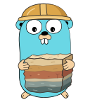

<a href="https://github.com/zigai/strata"></a>

# strata

strata is a layered configuration library for Go. One struct declares the defaults, and strata merges them with configuration files, environment variables, and CLI flags, recording which layer supplied each resolved key.

[](https://github.com/zigai/strata/actions/workflows/test.yml)
[](https://github.com/zigai/strata/releases)
[](https://pkg.go.dev/github.com/zigai/strata)
[](https://github.com/zigai/strata/blob/master/go.mod)
[](LICENSE)

```text
  Defaults  ->  System File  ->  User File  ->  Project File  ->  Environment  ->  CLI Flags
(Go Struct)      (/etc/xdg)     (~/.config)       ($PWD)           (APP_*)        (bridges)
```

Later layers override earlier ones, and a document overlays the result so far instead of replacing it, so a sparse file changes only the keys it mentions.

## Installation

```sh
go get github.com/zigai/strata
```

Requires Go 1.27+.

Flag handling lives in its own modules:

```sh
go get github.com/zigai/strata/bridge/cobra
go get github.com/zigai/strata/bridge/urfave
```

| Package | Purpose |
| --- | --- |
| `strata` | Loading, provenance, validation, and file editing |
| `strata/codec` | The `Codec` interface and TOML, YAML, and JSON adapters |
| `strata/bridge/cobra` | Cobra flag registration and synchronization |
| `strata/bridge/urfave` | `urfave/cli` flag registration and synchronization |

## Usage

```go
package main

import (
	"fmt"

	"github.com/zigai/strata"
)

type Config struct {
	Host string `strata:"host" toml:"host"`
	Port int    `strata:"port" toml:"port"`
}

// SetDefaults declares the values that rank below every other layer.
func (c *Config) SetDefaults() {
	c.Host = "127.0.0.1"
	c.Port = 8080
}

func main() {
	cfg, meta, err := strata.Load[Config](strata.WithAppName("myapp"))
	if err != nil {
		panic(err)
	}

	fmt.Printf("listening on %s:%d\n", cfg.Host, cfg.Port)

	if origin, ok := meta.Where("port"); ok {
		fmt.Printf("port came from the %s layer (%s)\n", origin.Source, origin.Path)
	}
}
```

With `.myapp.toml` in the working directory holding `port = 9000`, the program prints:

```text
listening on 127.0.0.1:9000
port came from the project layer (/home/you/project/.myapp.toml)
```

`Load` applies defaults first, reads each tier in ascending precedence, and validates the result. On error, the returned struct retains its defaulted values.

`LoadInto` merges into a value that already exists instead of starting from the zero value, and returns the same provenance. A key that no layer mentions keeps the value it started with:

```go
type State struct {
	Region string `strata:"region"`
	Port   int    `strata:"port"`
}

// State declares no SetDefaults, so only layers that mention a key change it.
state := State{Region: "eu-central-1"}

meta, err := strata.LoadInto(&state, strata.WithAppName("myapp"))
if err != nil {
	panic(err)
}
```

## Layers and discovery

Each file tier contributes at most one file in ascending precedence. A missing tier contributes nothing without error.

| Tier | `Origin.Source` | Location |
| --- | --- | --- |
| Go defaults | `default` | `SetDefaults` on the struct and nested structs, then `WithDefaults` |
| System file | `system` | `$XDG_CONFIG_DIRS/<app>/config.<ext>`, `/etc/xdg` when unset; `%ProgramData%\<app>\config.<ext>` on Windows |
| User file | `user` | `$XDG_CONFIG_HOME/<app>/config.<ext>`, `~/.config` when unset; `~/Library/Application Support/<app>/config.<ext>` on macOS; `%APPDATA%\<app>\config.<ext>` on Windows |
| Project file | `project` | `$PWD/.<app>.<ext>`, then `$PWD/.<app>/config.<ext>` |
| Environment | `env` | `<PREFIX><UPPER_SNAKE_KEY>` |
| CLI flags | `flag` | Applied by a bridge package after `Load` returns |

Extensions are discovered in order: `.toml`, `.yaml`, `.yml`, `.json`.

### Loading options

Options apply per call to `Load` or `LoadInto`:

- **Explicit file or standard input:** `WithExplicitPath("config.yaml")` loads a single file and skips discovery. The path `-` reads standard input (cached for the process).
- **Environment prefix:** `WithEnvPrefix("MYAPP_")` maps fields to uppercase environment variables (e.g. `database.port` matches `MYAPP_DATABASE_PORT`). An `env` tag sets an exact name.
- **Working directory:** `WithCWD(dir)` overrides the directory searched for the project file.
- **File limits:** `WithMaxFileSize(bytes)` sets the maximum file size (default 1 MiB); exceeding it returns `ErrFileTooLarge`. `WithoutFiles()` disables file discovery entirely.
- **Format filters:** `WithFormats("toml", "yaml")` restricts discovery and sets precedence order across tiers.

### Keys and secrets

Fields resolve from the first matching `strata`, `toml`, `yaml`, or `json` tag, falling back to the snake case Go field name. Nested structs use dot notation (`database.port`).

```go
type Config struct {
	Port   int    `strata:"port"`
	APIKey string `env:"API_KEY,secret"`
}
```

Fields tagged `secret` are redacted across environment reporting, provenance (`[REDACTED]`), and CLI flag help.

### Custom formats and decoders

```go
// Map an alternative extension to an existing format:
strata.WithFormatAlias(".conf", "toml")

// Bind an external unmarshaler without implementing Codec:
strata.WithDecoder(".json5", json5.Unmarshal)

// Bind a type-safe decoder for custom or proprietary formats:
strata.WithDecoderFunc(".env", func(data []byte, target *Config) error {
	target.Host = "127.0.0.1"
	return nil
})
```

To provide both encoding and decoding for a format, implement `Codec` and register it with `WithCodec`.

## Provenance

`Load` returns `*Metadata` tracking the origin of every resolved key:

```go
if origin, ok := meta.Where("database.port"); ok {
	fmt.Printf("%s set by %s (line %d): %s\n", origin.Key, origin.Path, origin.Line, origin.RawValue)
}

fmt.Println("Active files:", meta.ActiveFiles())
```

`Origin.Source` reports the supplying tier (`default`, `system`, `user`, `project`, `env`, `flag`). The YAML reader also records `Line`.

## Validation

Validation runs after defaults, files, and environment variables are merged, and before any CLI overlay.

Implement `MetadataValidator` instead of `Validator` to attribute a failure to the key that caused it:

```go
func (c *Config) ValidateWith(meta *strata.Metadata) error {
	if c.Port > 9000 {
		return meta.NewConfigError("port", errors.New("above the privileged ceiling"))
	}
	return nil
}
```

With `port = 9090` in `.myapp.toml`, the load fails with:

```text
config error: above the privileged ceiling for port: "9090"
  --> set by /home/you/project/.myapp.toml
```

The YAML reader adds the line it found the key on (`--> set by /home/you/project/.myapp.yaml:2`). Every validation failure reaches the caller as a `*ConfigError`, which unwraps to the cause.

## CLI flags

Struct tags declare CLI flags mapped by the bridge modules:

| Tag | Flag |
| --- | --- |
| `flag:"port"` | Long name only (`--port`) |
| `flag:"port,p"` | Long name with shorthand (`-p, --port`) |
| `flag:",p"` | Derived kebab-case name with shorthand |
| `flag:""` | Derived kebab-case name |

Untagged fields remain configuration-only. An embedded struct contributes its fields directly, and tagged nested structs prefix their flags (e.g. `flag:"db"` on `Database` produces `--db-host`).

In Cobra, register flags before parsing and synchronize within `PersistentPreRunE`:

```go
settings.SetDefaults()

err := stratacobra.RegisterFlags(cmd, &settings, stratacobra.WithPersistent())

// Inside PersistentPreRunE after parsing:
view, meta, err := strata.Load[settingsView](strata.WithAppName("myapp"))
if err != nil {
	return err
}

settings = AppSettings(view)

if err := stratacobra.SyncFlagsToStruct(cmd, &settings, stratacobra.WithMetadata(meta)); err != nil {
	return err
}

if err := settings.Validate(); err != nil {
	return err
}

if err := stratacobra.Apply(cmd, settings); err != nil {
	return err
}
```

`SyncFlagsToStruct` copies user-supplied flags into the struct, `Validate` checks the merged result, and `Apply` populates omitted flags from configuration so `cmd.Flags()` and the struct match.

`bridge/urfave` provides `strataurfave.RegisterFlags`, `strataurfave.SyncFlagsToStruct`, and `strataurfave.Apply` for `urfave/cli`, as well as `GenerateFlags` to produce `[]cli.Flag` values.

[`examples/cli`](examples/cli) is a runnable command built this way, with provenance printing, an explicit `--config` path, and a `config set` command.

## Editing files

`Set` updates a key in a configuration file in place, preserving existing comments, key order, and indentation:

```go
err := strata.Set("config.toml", "database.port", 5433)
```

- **TOML:** Keeps comments, blank lines, indentation, and key order.
- **YAML:** Keeps comments, key order, and anchors. Blank lines are dropped.
- **JSON:** Keeps indentation and number precision. Sorts object keys.

`SetBytes` applies the same in-place edit to a byte slice. For files the application owns outright, `Save` serializes the struct and replaces the file atomically:

```go
err := strata.Save("state.json", cfg)
```

### Templates and schemas

`Init` writes a configuration template holding the defaults of the type, in the format implied by the extension. An existing file is left untouched and reported as `ErrFileExists` unless `WithOverwrite(true)` is passed:

```go
err := strata.Init[Config]("config.toml", strata.WithSchemaURL("https://example.com/strata.schema.json"))
```

`WithSchemaURL` embeds the schema directive: `#:schema <url>` for TOML, `# yaml-language-server: $schema=<url>` for YAML, and `$schema` for JSON.

`Schema[Config]` returns the JSON Schema for the type as indented JSON. Field names match configuration keys, and a doc comment on a struct field becomes its description in the schema:

```go
schema, err := strata.Schema[Config](
	strata.WithSchemaID("https://example.com/strata.schema.json"),
	strata.WithSchemaTitle("Myapp configuration"),
)
```

## Durations and errors

`strata.Duration` is a `time.Duration` that parses day and week units, which `time.ParseDuration` rejects: `7d`, `2w`, `1w2d`, `1.5d`, and `-7d` are all valid. Values re-encode through the underlying `time.Duration`, so `2w` formats as `336h0m0s`:

```go
type Config struct {
	Timeout strata.Duration `strata:"timeout"`
}

d, err := strata.ParseDuration("1w2d") // 216h0m0s
```

Every failure the package names is classifiable through a sentinel on the package, so callers never import a subsystem to branch on errors:

```go
if errors.Is(err, strata.ErrMalformed) {
	// A file was found but could not be parsed, which is a different problem
	// from no file being found at all.
}
```

## License

[MIT](LICENSE)
